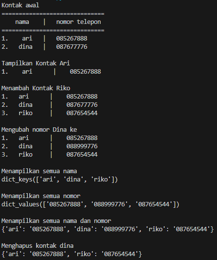

# Latihan 

1. membuat kontak awal
`````python
b = {'ari' : '085267888', 'dina' : 087677776}
`````
2. menampilkan kontak ari
``````Python
print(b['ari'])
``````
3. menambhkan kontak riko
``````python
b['riko']= 087888999
``````
4. mengubah kontak dina
``````python
b['dina]= '089555777
``````
5. menampilkan semua nama
``````python
print(b.keys())
``````
6. menampilkan semua nomor
``````python
print(b.values())
``````
7. menampilkan semua nama dan nomor
``````python
print(b)
``````
8. menghapus kontak dina
``````python
del b['dina']
``````

## Programnya :

``````python
b={'ari':'085267888','dina':'087677776'}
print('Kontak awal')
print('==============================')
print('    nama    |   nomor telepon')
print('==============================')
print('1.    ari   |   085267888','\n2.   dina   |   087677776')

# Tampilkan kontak ari
print('\nTampilkan Kontak Ari')
print('1.    ari      |   ',b['ari'])
print('\nMenambah Kontak Riko')
b['riko']='087654544'
print('1.   ari      |   ',b['ari'])
print('2.   dina     |   ',b['dina'])
print('3.   riko     |   ',b['riko'])
print('\nMengubah nomor Dina ke')
b['dina']='088999776'
print('1.   ari      |   ',b['ari'])
print('2.   dina     |   ',b['dina'])
print('3.   riko     |   ',b['riko'])
print('\nMenampilkan semua nama')
print(b.keys())
print('\nMenampilkan semua nomor')
print(b.values())
print('\nMenampilkan semua nama dan nomor')
print(b)
print('\nMenghapus kontak dina')
del b['dina']
print(b,'\n')
``````

### Outputnya :

