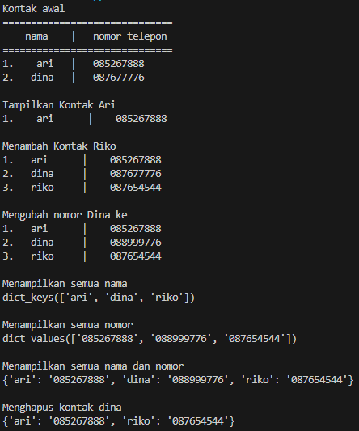

# Pertemuan-10

| Variable | Isi |
| -------- | --- |
| **Nama** | Muhammad Nurul Firdaus |
| **NIM** | 312310495 |
| **Kelas** | TI.23.A.5 |
| **Mata Kuliah** | Bahasa Pemrograman |

# Latihan 

1. membuat kontak awal
`````python
b = {'ari' : '085267888', 'dina' : 087677776}
`````
2. menampilkan kontak ari
``````Python
print(b['ari'])
``````
3. menambhkan kontak riko
``````python
b['riko']= 087888999
``````
4. mengubah kontak dina
``````python
b['dina]= '089555777
``````
5. menampilkan semua nama
``````python
print(b.keys())
``````
6. menampilkan semua nomor
``````python
print(b.values())
``````
7. menampilkan semua nama dan nomor
``````python
print(b)
``````
8. menghapus kontak dina
``````python
del b['dina']
``````

## Programnya :

``````python
b={'ari':'085267888','dina':'087677776'}
print('Kontak awal')
print('==============================')
print('    nama    |   nomor telepon')
print('==============================')
print('1.    ari   |   085267888','\n2.   dina   |   087677776')

# Tampilkan kontak ari
print('\nTampilkan Kontak Ari')
print('1.    ari      |   ',b['ari'])
print('\nMenambah Kontak Riko')
b['riko']='087654544'
print('1.   ari      |   ',b['ari'])
print('2.   dina     |   ',b['dina'])
print('3.   riko     |   ',b['riko'])
print('\nMengubah nomor Dina ke')
b['dina']='088999776'
print('1.   ari      |   ',b['ari'])
print('2.   dina     |   ',b['dina'])
print('3.   riko     |   ',b['riko'])
print('\nMenampilkan semua nama')
print(b.keys())
print('\nMenampilkan semua nomor')
print(b.values())
print('\nMenampilkan semua nama dan nomor')
print(b)
print('\nMenghapus kontak dina')
del b['dina']
print(b,'\n')
``````

### Outputnya :



# Tugas praktikum
## Program sederhana yang akan menampilkan daftar nilai mahasiswa
## Flowchart 
  \
* Membuat lopping agar program terus berjalan:
``````python
while True :
    c = input("\n(L)ihat, (T)ambah,(U)bah, (C)ari, (K)eluar: ")
``````
* Membuat formatif if untuk memasukan pilihan , contoh pilihan (t):
``````python
if (c.lower() == 't'):                                               
    print('\nTambah Data Mahasiswa Baru')
    nama= input("Masukkan Nama\t\t: ")                                        
    nim= input("Masukkan NIM\t\t: ")                                         
    nilaiTugas= int(input("Masukkan Nilai Tugas\t: "))                              
    nilaiUts= int(input("Masukkan Nilai UTS\t: "))                                   
    nilaiUas= int(input("Masukkan Nilai UAS\t: "))                                    
    nilaiAkhir= (0.30 * nilaiTugas) + (0.35 * nilaiUts) + (0.35 * nilaiUas)              
    dataMhs[nama]= nim, nilaiTugas, nilaiUts, nilaiUas, nilaiAkhir                         
    print("\nData Berhasil Ditambahkan!")
``````
* membuat percabangan elif untuk menjalankan pilihan yang lain
``````python
elif (c.lower() == 'u'):                                                                    
        print('\nMengubah Data Mahasiswa')
        nama = input("Masukkan Nama: ")                                                         
        if nama in dataMhs.keys():                              
            nim= input("Masukkan NIM Baru\t: ")                              
            nilaiTugas= int(input("Masukkan Nilai Tugas\t: "))                           
            nilaiUts= int(input("Masukkan Nilai UTS\t: "))                           
            nilaiUas= int(input("Masukkan Nilai UAS\t: "))                           
            nilaiAkhir= (0.30 * nilaiTugas) + (0.35 * nilaiUts) + (0.35 * nilaiUas)          
            dataMhs[nama] = nim, nilaiTugas, nilaiUts, nilaiUas, nilaiAkhir                      
            print("\nData Berhasil Di Update!")
        else:                                                                                    
            print("Data tidak ditemukan!")                                                       
    elif (c.lower() == 'c'):                                                                    
        print('\nCari Data Mahasiswa')
        nama = input("Masukan Nama:  ")                                                          
        if nama in dataMhs.keys():                                                               
            print("\n                   DAFTAR NILAI MAHASISWA                   ")
            print("==============================================================")
            print("|     Nama     |    NIM    | Tugas |  UTS  |  UAS  |  Akhir |")
            print("==============================================================")
            print("| {0:12s} | {1:9s} | {2:5} | {3:5} | {4:5} | {5:6} |".format(nama, nim, nilaiTugas, nilaiUts, nilaiUas, nilaiAkhir)) 
            print("==============================================================")
        else:
            print("Datanya {0} Tidak Ada ".format(nama))                                        
    elif (c.lower() == 'h'):                                                                    
        nama = input("Masukkan Nama Yang Akan Dihapus:  ")                                                        
        if nama in dataMhs.keys():                                                              
            del dataMhs[nama]                                                                   
            print("Data Telah dihapus!")
        else:
            print("Data Mahasiswa Tidak Ada".format(nama))                                     
    elif (c.lower() == 'l'):                                                                    
        if dataMhs.items():                                                                     
            print("\n                      DAFTAR NILAI MAHASISWA                    ")
            print("==================================================================")
            print("| No |     Nama     |    NIM    | Tugas |  UTS  |  UAS  |  Akhir |")
            print("==================================================================")
            i = 0
            for x in dataMhs.items():
                i += 1
                print("| {6:2} | {0:12s} | {1:9s} | {2:5} | {3:5} | {4:5} | {5:6} |".format(x[0], x[1][0], x[1][1], x[1][2], x[1][3], x[1][4], i))  
            print("==================================================================")
        else:
            print("\n                      DAFTAR NILAI MAHASISWA                    ")
            print("==================================================================")
            print("| No |     Nama     |    NIM    | Tugas |  UTS  |  UAS  |  Akhir |")
            print("==================================================================")
            print("|                          TIDAK ADA DATA!                       |")
            print("==================================================================")
    elif (c.lower() == 'k'):                                                                   
        print('\n')
        print(23*'=')
        print("Nama\t: M.Nurul F\nKelas\t: TI.23.A5\nNIM\t: 312310495")
        print(23*'=')
        break
``````
* menggunakan else apabila salah memasukan pilihan 
``````python
else:
    print("Pilih menu yang tersedia: ") 
``````
### Output program sebelum diinputkan data(L):


### Output program setelah diinputkan data(T):


### Output program setelah datanya diubah(U):


### Output Program saat di cari(C) :


### Output program setelah datanya di hapus(H):


### Output Program setelah keluar(K):

